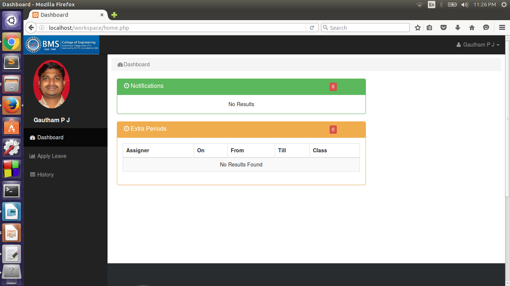
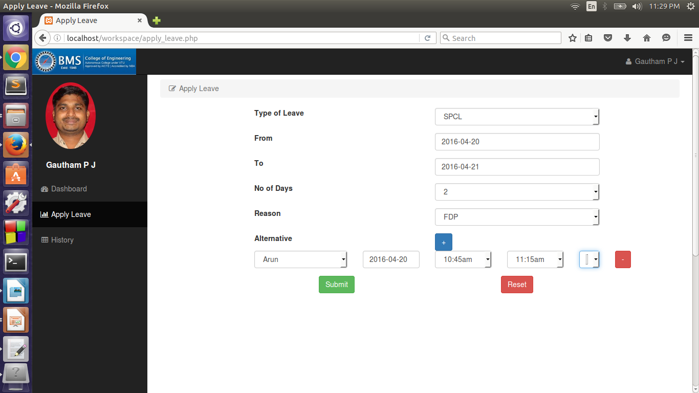
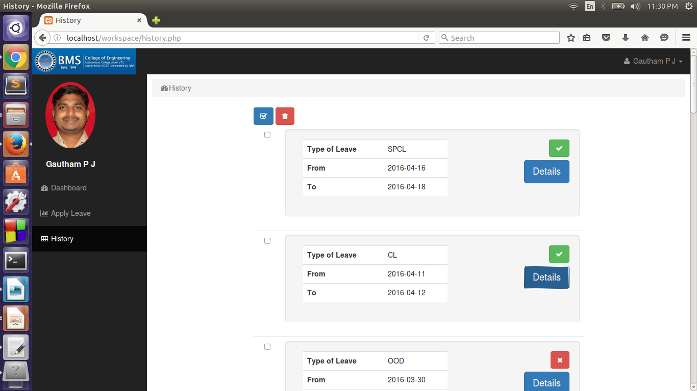
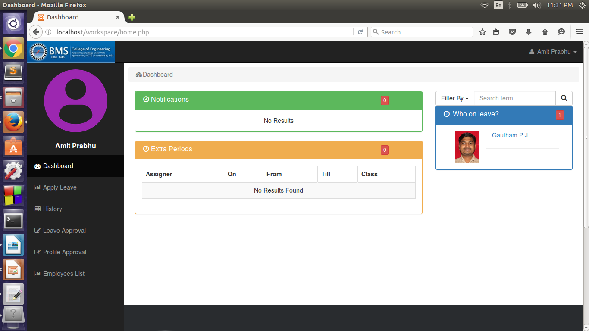
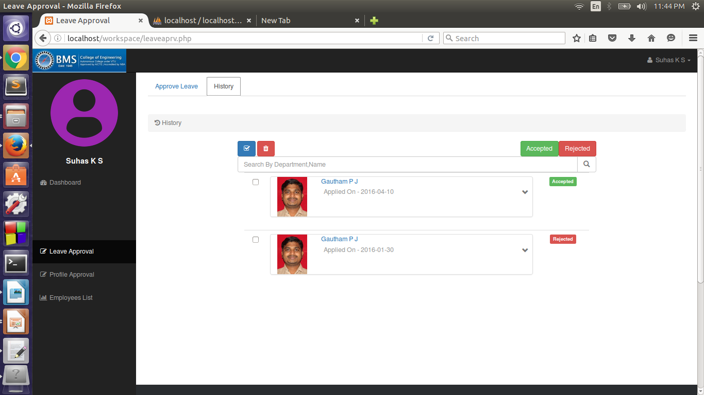
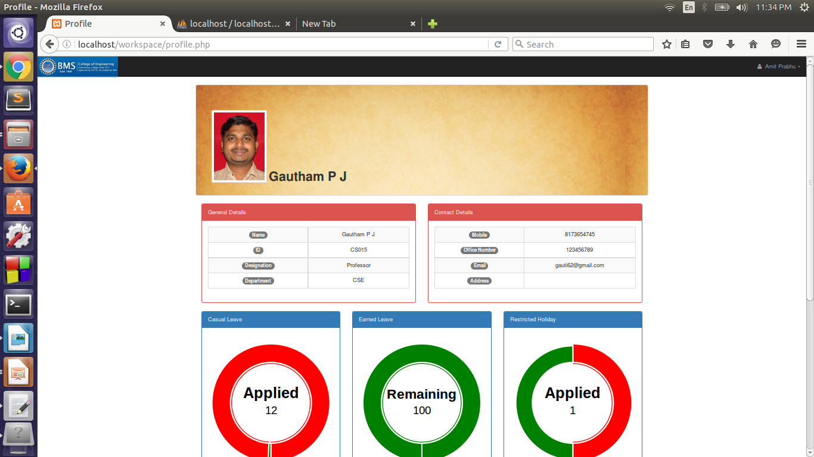
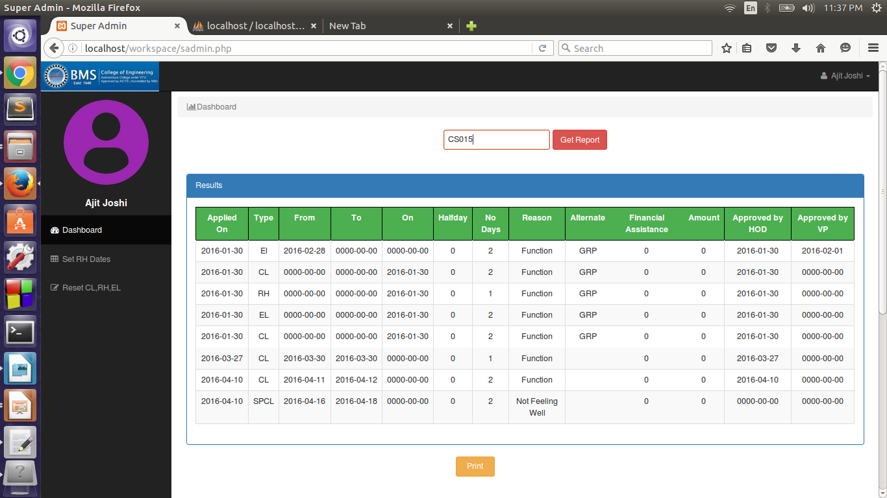
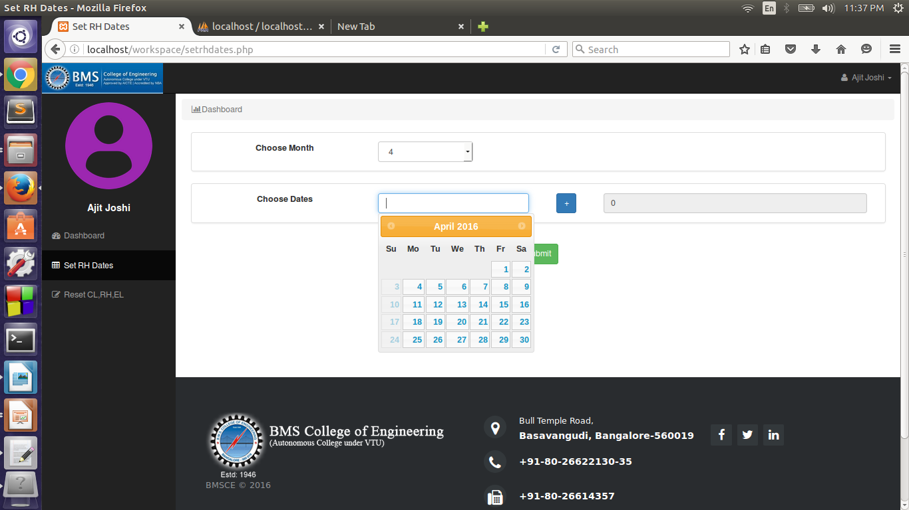
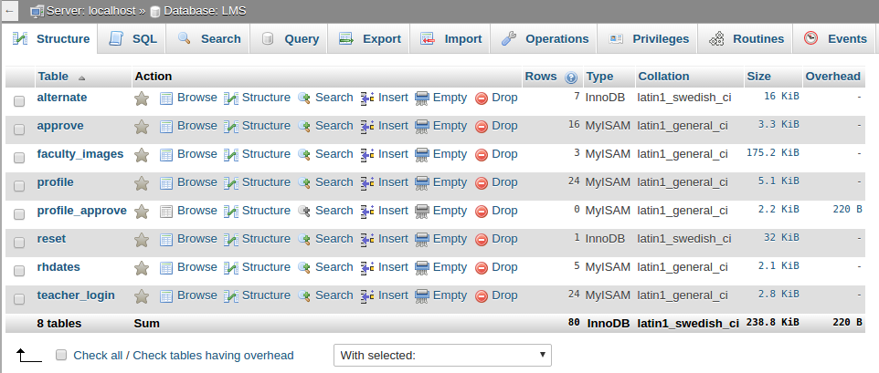

# Leave-Management-System-Website
A website which automates the leave management process in Educational Institutions, by intelligently adapting to HR policy of the organization, decreasing paperwork and enabling the process with efficient record maintenance.

## Existing System
In the existing system many colleges follow manual procedure in which employees fill an application form and submit to the respective authorities and have to keep inquiring in the department office regarding the status. Hence it is a time consuming process. Establishment section people have to manually feed application data into computer for record maintenance. All these things make leave management, a tedious task.

## Proposed System
In the proposed system work-flow is automated and employees get instant notification of the status of their applied leaves. Every accepted leave, gets saved in the database, reducing the manual work of establishment section. It gives details of previously applied leaves to each employee. It gives details about extra periods to each person, assigned as alternates by a person on leave. It lists employees on leave to Admin. All these things make leave management process  time-efficient and reliable. Also, since the process is digitalized, it completely eliminates paperwork.

## Actors

1. **Staff**  
- Ex: Faculty(Professor, Associate Professor, Assistant Professor etc) and Non Faculty(Librarian, Clerk, Lab Instructor etc.)  
- Capabilities: 
    1. To apply for leave 
    2. To view History ( Previously applied leave applications 		along with status )
    3. Get details about extra periods assigned by person on 		leave 
    4. Get notifications for recently applied leaves 
    5. Managing profile information.

2. **Admin**  
- Ex: HOD  
- Capabilities: 
    1. Profile Approval : Approve profile of newly registered employees in the department 
    2. Leave Approval : Approve leave applications of employees from his department and forward it to Vice Principal or Principal in case type of leave is RH, EL,OOD and SPCL. 
    3. Faculty and Non Faculty List : View number of leaves applied and  complete profile information of all employees under his department and edit if appropriate 
    4. Dashboard : View list of employees on leave under his department on respective days 
    5. Functionalities of common staff.

3. **Super Admin**   
- Ex: Vice Principal/Principal  
- Capabilities : 
    1. Approve profile of newly registered HODs, Dean etc. in the college. 
    2. Approve leave applications of employees forwarded   through HODs of respective departments and leave applications from HODs and Dean. 
    3. View number of leaves applied and complete profile information of all employees in college and edit if appropriate. 
    4. View list of employees on leave under any department on respective days

4. **Establishment Section**  
- The department in the college which keeps record of all the leaves applied by the employees.    
- Capabilities :
    1. Print leave report of any employee on demand 
    2. Set Restricted Holidays on monthly basis 
    3. Reset Leaves of all employees on yearly basis

## Screenshots  

1. **Home Page**  
  

2. **Faculty Dashboard**
  

3. **Leave Application Form**
  

4. **Leave History**
  

5. **HOD/VP/Principal Dashboard**
  

6. **Leave Approval Form**

7. **Approval History**

8. **Profile View**
  

9. **Report Generation for Admin**
  

10. **Customize Holidays for Admin**

11. **Database Schema**

