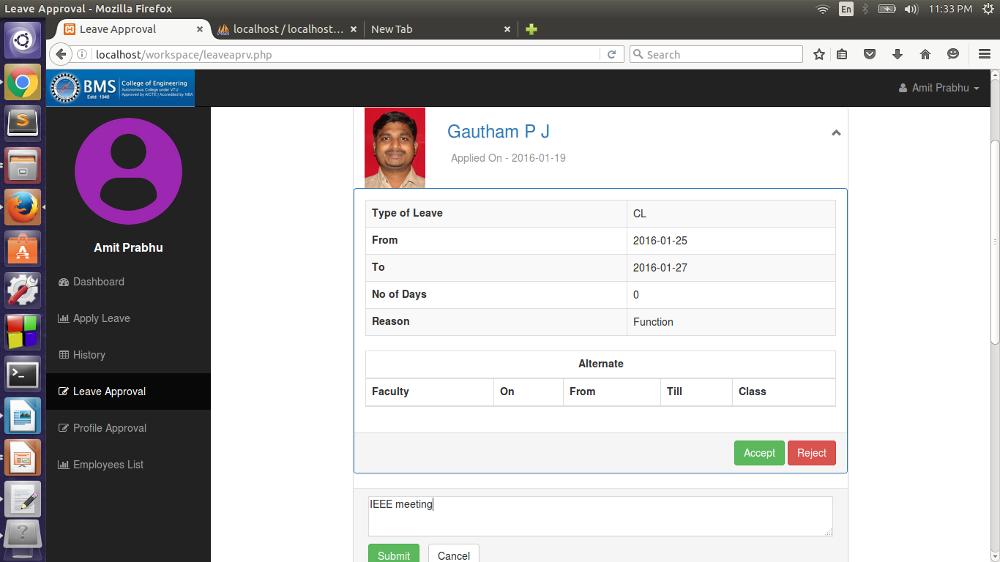

# Leave-Management-System-Website
A website which automates the leave management process in Educational Institutions, by intelligently adapting to HR policy of the organization, decreasing paperwork and enabling the process with efficient record maintenance.

## Screenshots  

1. **Home Page**  
  

2. **Faculty Dashboard**
  

3. **Leave Application Form**
  

4. **Leave History**
  

5. **HOD/VP/Principal Dashboard**
  

6. **Leave Approval Form**

7. **Approval History**

8. **Profile View**
  

9. **Report Generation for Admin**
  

10. **Customize Holidays for Admin**

11. **Database Schema**

